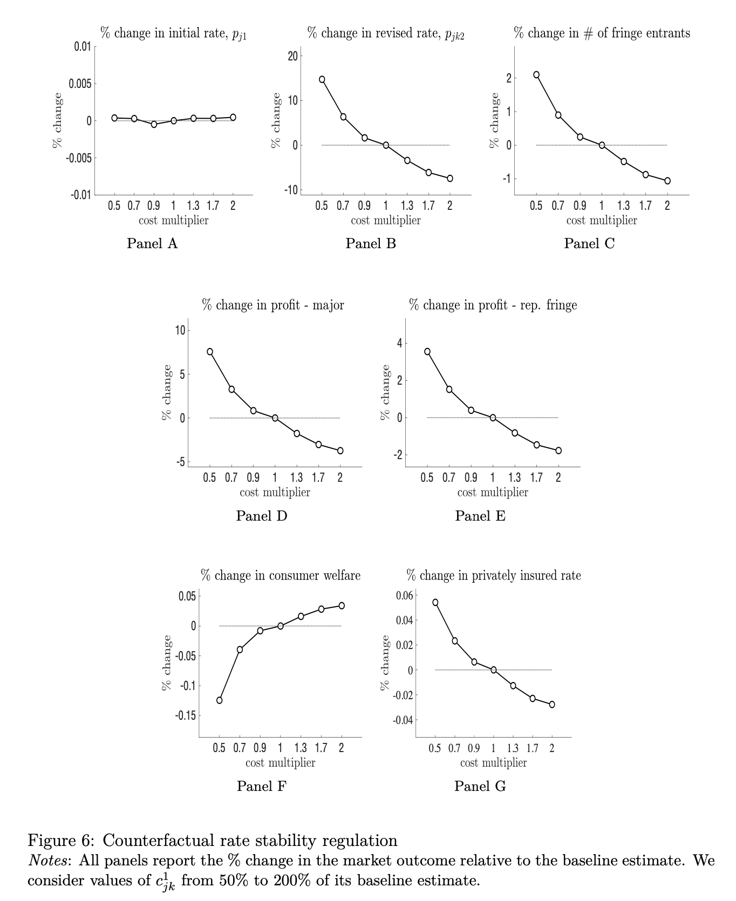
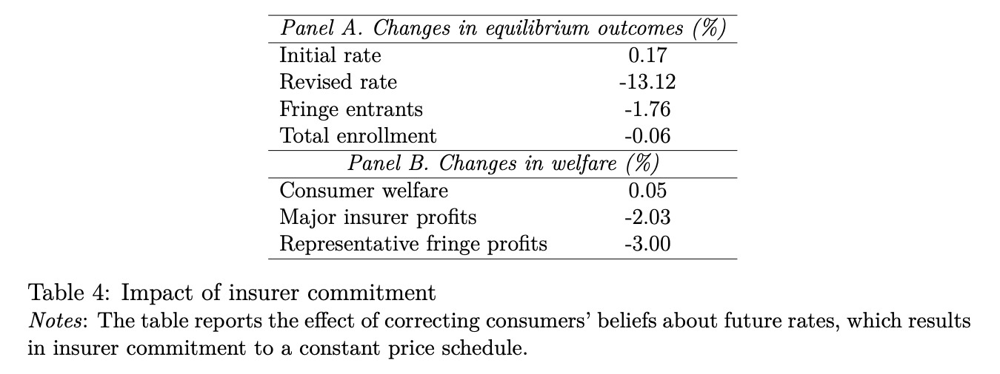
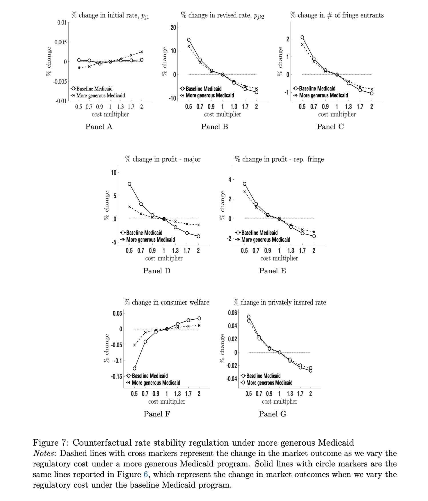

```{r setup, include=FALSE}
knitr::opts_chunk$set(echo = TRUE)
library(bookdown)
```

# Summary of the Paper

（ひとことメモ）

- 米国長期医療保険（long-term care insurance (LTCI)）市場におけるdynamic pricing regulation（保険者による、期中の保険料変更対する規制）に関する政策評価。
- dynamic pricing regulationはrisk averseな消費者にとっては詳細の価格の不確実性が減少するというポジティブな影響がある一方、保険会社の価格設定の柔軟性が下がることによる利益の低下、さらには低い利益を見込むことにより市場参入が少なくなるといったネガティブな影響も考えられる。
- 本論文ではDemand、Supply両方のモデル化→パラメータ推定→Counterfacturalによりdynamic pricing regulationによる経済厚生の変化をシミュレーションしている。
- 結果、dynamic pricing regulationの強化はむしろ経済厚生を低下させる。これを緩和させる策として、（公的保険の）Medicaidの拡大を合わせて行うことを提案している。

## Motivation

- To prevent insurers from passing through aggregate risks to consumers, governments have increasingly adopted dynamic pricing regulations that limit insurers' ability to change premiums over time. 
- This paper develops and estimates an equilibrium model with dynamic pricing and firm entry and uses it to evaluate the design of dynamic pricing regulations in the U.S. long-term care insurance (LTCI) market. 
- We find that stricter dynamic pricing regulation lowers social welfare as the benefit from improved premium stability is outweighed by the cost of reduced insurer participation. The welfare loss from stricter dynamic pricing regulation could be mitigated if the government also expands public LTCI through Medicaid.


## Related Literature and Contribution

- This research contributes to three strands of literature on social insurance and insurance markets.
  1. It contributes to the growing literature that evaluates the welfare effects of LTCI.
    - Related Literature: Brown and Finkelstein (2008), Lockwood (2018), Ameriks et al. (2016), Mommaerts (2020) Ko, (2022),  Braun et al. (2019) 
  1. This study is related to the large literature that investigates policy designs in insurance markets.
    - Related Literature: Einav et al. (2010), Koijen and Yogo (2015, 2016), Koijen and Yogo (2022) 
  1. Our work adds to the literature on long-term insurance. 
    - Related Literature: Cochrane (1995) , Hendel and Lizzeri (2003), Handel et al. (2015), Handel et al. (2017), Fleitas et al. (2018), Atal (2019), Atal et al. (2020)  

# Details of the Paper

## Model

- There are $M$ LTCI markets that are defined by a geographical state and calendar year
- In each market, there exists a unit mass of potential consumers and many potential insurers 
- There are three stages in the model (see Figure 5)
  - In stage 0, insurers decide whether to enter the market based on the entry cost and the expected profit
  - In stage 1, insurers set an initial price for their LTCI contract
  - In stage 2, the uncertainty about aggregate risk is resolved, and insurers revise their price determined in the first stage. Consumers with private LTCI might lapse their contract, and LTC utilization takes place in the end.


### Fringe firms' entry decision

- Fringe firms will enter the market if their expected profit is equal to or greater than their entry cost $c^{e}$, which follows the CDF denoted by $G$. - Once fringe firms enter, they will respectively earn the profit of

$$
\max \{\frac{1}{n_{J}} \Pi^{∗}_{J} −c^{e}, 0 \}
$$

### Firms’ initial pricing and consumers’ insurance choice

- At the beginning of stage 1, the market consists of $J − 1$ major firms and one representative fringe which is the collection of fringe entrants. 
- Let $j \in \{1, 2,..., J \}$ index insurers where j$ = J$ means the representative fringe. 
- Insurer $j$’s profit in stage 1 is

$$
\Pi_{j1} = p_{j1}s_{j1} − C_{j}^{l}(p_{j1} − \tilde{\mu_{j}})
$$

- Consumer $i$’s flow utility from contracting with insurer $j$ in stage 1 is

$$
\tilde{u}_{ij1} = \alpha u(y_{i}− p_{j1}) + \gamma I(j = J) \ln(n_{J}) + \xi_{j} + \varepsilon_{ij}
$$

- If consumer $i$ does not purchase any private LTCI, then her utility in stage 1 is given by
$$
\tilde{u_{i01}} = \alpha u(y_{i}) + \varepsilon_{i0}
$$

### Firms’ revised pricing

- There are $K$ possible aggregate states of the world in stage 2, and each state happens with probability $\Pi_{k}$ where $k = 1, ..., K$
- When state $k$ is realized, insurers learn that the expected claims cost from their existing cohort of consumers is equal to $\mu_{jk}$.
- Insurers then decide whether to increase the initial premium, and if so, by how much. Insurers are subject to the rate adjustment cost $C^{rs}_{jk}(p_{j1} ,p_{jk2})$, which represents the cost associated with revising the premium from $p_{j1}$ to $p_{jk2}$ when the realized state is $k$ in stage 2.
- Insurer $j$’s profit from the second stage when the realized state is $k$ is
$$
\Pi =(p_{jk2} − \mu_{jk})s_{jk2} − C^{rs}_{jk}(p_{j1} ,p_{jk2})
$$

- When the realized state is $k$, consumer $i$’s expected utility from holding the contract sold by insurer $j$ is


$$
\tilde{u}_{ijk} = (1 − \delta_{k})u_{ijk, stay} + \delta_{k}u_{ik, lapse}
$$

- The utility from retaining the current contract is given by

$$
u_{ijk, stay} = \alpha u(y_{i}−p_{jk2}) + \gamma I(j = J)\ln(n_{J}) + \xi_{j} 
$$

- The utility from terminating the contract is given by
$$
u_{ik,lapse} = \int_{\lambda} \alpha u(y_{i} − oop(\lambda, y_{i}))f_{k}(\lambda) d\lambda
$$

### Equilibrium

- Consumers in the first period make insurance purchase decisions to maximize their lifetime utility. 
- Consumer $i$’s expected lifetime utility from contracting with insurer $j \in \{1, ..., J \}$ is
$$
\tilde{v}_{ij} = \alpha u(y_{i} − p_{j1}) + \gamma I(j = J) \ln(n_{J}) + \xi_{j} + \beta_{c}\sum_{k} \pi_{k}((1 − \delta_{k})u_{ijk, stay} + \delta_{k}u_{ik, lapse}) + \varepsilon_{ij}
$$

- The consumer’s expected lifetime utility from not purchasing any insurance is
$$
\tilde{v}_{0} = \alpha u(y_{i}) + \beta_{c} \sum_{k} \pi_{k} u_{ik, lapse} + \varepsilon_{i0}
$$

- If $j^{∗}$ is the chosen option by consumer $i$, then $j^{∗} = \mathop{\rm argmax}\limits_{j = 0, 1, ..., J} \tilde{v}_{ij}$.

- Insurers’ problem can be solved backwards. In stage 2, given the realized state $k$, each insurer $j$ chooses the revised premium by maximizing its state-specific profit:
$$
\Pi^{∗}_{jk2} = \max_{p_{jk2}}(p_{jk2} − \mu_jk)s_{jk2} − C^{rs}_{jk}(p_{j1} ,p_{jk2})
$$

- Given the optimal sequence of $\{ p_{jk2} \}^{K}_{k = 1}$ which is a function of the initial premium $p_{j1}$, insurer $j$ in stage 1 chooses $p_{j1}$ to maximize its profit over the lifetime of LTCI contracts: 
$$
\Pi^{∗}_{j} = \max_{p_{j1}} p_{j1}s_{j1} −C^{l}_{j}(p_{j1} - \tilde{\mu}_{j}) + \beta_{f}\sum_{k}\pi_{k}\Pi^{∗}_{jk2}
$$

- In stage 0, a fringe firm with entry cost $c^{e}$ will enter the market if
$$
c^{e} \leq \frac{1}{n_{J}} \Pi^{∗}_{J}
$$

- We characterize a Nash equilibrium in each market that consists of the vector of premiums $(p_{j1},\{ p_{jk2} \}^{K}_{k = 1})$ for each insurer $j$ and the number of fringe insurers $n_{J}$ that solve above equations.


## Estimation Results


## Counterfactuals

- In this paper, three counterfactuals are conducted:
 1. Welfare effect of rate stability regulation
 
 
 
 2. Value of commitment
 
 
 
 3. Interaction between rate stability regulation and Medicaid




