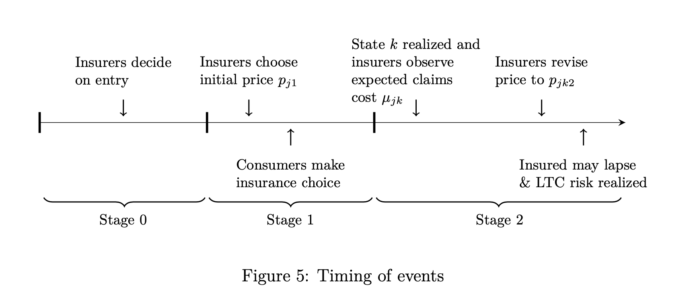
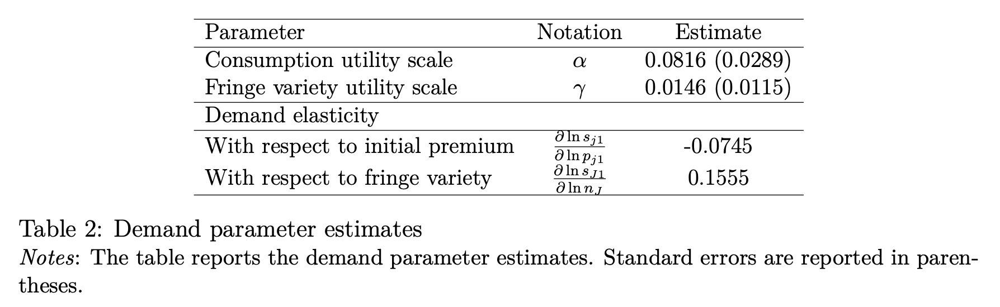
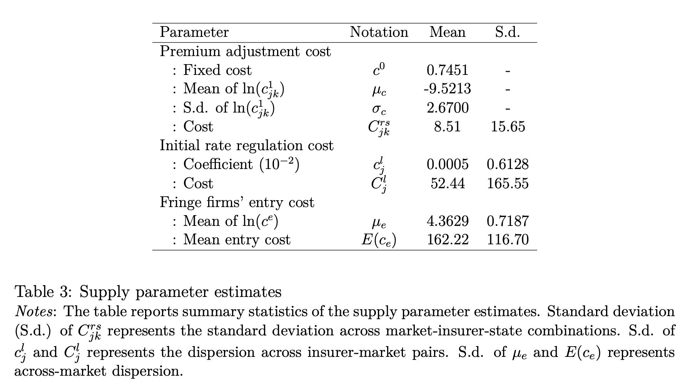

```{r setup, include=FALSE}
knitr::opts_chunk$set(echo = TRUE)
library(bookdown)
```

# Summary of the Paper

（ひとことメモ）


## Motivation

- 

## Related Literature

- 

## Contribution

- 

# Details of the Paper

## Model

- There are $M$ LTCI markets that are defined by a geographical state and calendar year
- In each market, there exists a unit mass of potential consumers and many potential insurers 
- There are three stages in the model (see Figure 5)
  - In stage 0, insurers decide whether to enter the market based on the entry cost and the expected profit
  - In stage 1, insurers set an initial price for their LTCI contract
  - In stage 2, the uncertainty about aggregate risk is resolved, and insurers revise their price determined in the first stage. Consumers with private LTCI might lapse their contract, and LTC utilization takes place in the end.



### Fringe firms' entry decision

- Fringe firms will enter the market if their expected profit is equal to or greater than their entry cost $c^{e}$, which follows the CDF denoted by $G$. - Once fringe firms enter, they will respectively earn the profit of

$$
\max \{\frac{1}{n_{J}} \Pi^{∗}_{J} −c^{e}, 0 \}
$$

### Firms’ initial pricing and consumers’ insurance choice

- At the beginning of stage 1, the market consists of $J − 1$ major firms and one representative fringe which is the collection of fringe entrants. 
- Let $j \in \{1, 2,..., J \}$ index insurers where j$ = J$ means the representative fringe. 
- Insurer $j$’s profit in stage 1 is

$$
\Pi_{j1} = p_{j1}s_{j1} − C_{j}^{l}(p_{j1} − \tilde{\mu_{j}})
$$

- Consumer $i$’s flow utility from contracting with insurer $j$ in stage 1 is

$$
\tilde{u}_{ij1} = \alpha u(y_{i}− p_{j1}) + \gamma I(j = J) \ln(n_{J}) + \xi_{j} + \varepsilon_{ij}
$$

## Estimation Results






